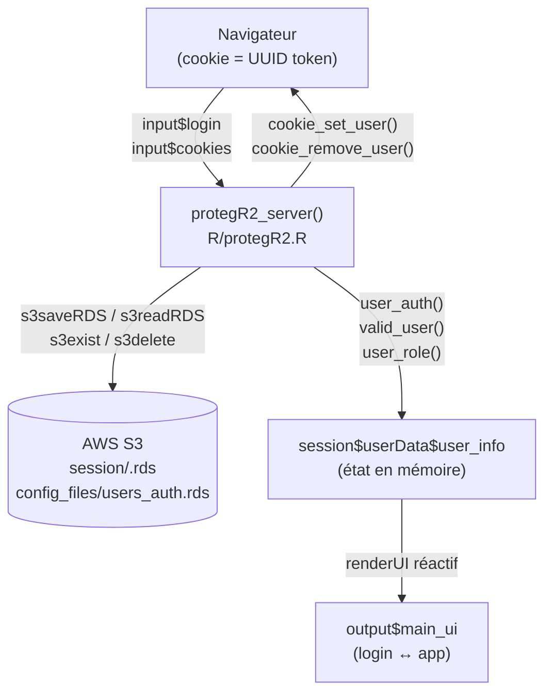

# Flux d'authentification — protegR2

## Vue d'ensemble

protegR2 gère l'authentification d'applications Shiny via trois mécanismes
complémentaires : login manuel (formulaire), auto-login par cookie (reconnexion
transparente au refresh), et logout. La persistance des sessions repose
exclusivement sur AWS S3 via le package `s3db` — pas de base de données
relationnelle requise.

Le principe central : **le cookie navigateur ne contient qu'un token UUID**.
Toute la validation (expiration, fingerprint, identité) se fait côté serveur sur
S3. Un cookie volé sans le fingerprint correspondant ne permet pas de se connecter.

---

## Diagramme d'architecture



---

## Les 3 flux principaux

### 1. Login manuel

Déclenché par le clic sur le bouton login (`observeEvent(input$login, ...)`).
Les validations s'exécutent dans cet ordre précis — du moins coûteux au plus
coûteux :

```
input$login
  │
  ├─ 1. Verrou brute force ?        → block 30s si ≥ 5 tentatives (local session)
  ├─ 2. Champs vides ?              → rejet immédiat (trimws appliqué)
  ├─ 3. Lecture users_auth.rds      → 1 seul appel S3 pour toutes les vérifs suivantes
  ├─ 4. Username existe ?           → exactement 1 ligne (doublon aussi rejeté)
  ├─ 5. Compte actif ?              → colonne active == TRUE
  ├─ 6. Compte non expiré ?         → expire_date >= Sys.Date() (NA = jamais expire)
  └─ 7. Mot de passe bcrypt ?       → password_verify() ~100-300ms, intentionnellement lent
        │
        └─ Succès :
             ├─ Générer UUID v4 (token_value)
             ├─ Supprimer anciens tokens S3 de cet user  ← invalide sessions précédentes
             ├─ perform_login()
             │    ├─ Stocker token/user/role dans session$userData$user_info
             │    └─ cookie_set_user()
             │         ├─ Écrire session/<token>.rds sur S3
             │         └─ Poser cookie navigateur (value = token UUID)
             └─ user_auth(username)  ← déclenche renderUI → affiche l'app
```

**Pourquoi les validations dans cet ordre ?**
Les étapes 1 et 2 ne font aucun appel réseau. L'appel S3 (étape 3) n'est fait
qu'une fois, et bcrypt (étape 7) — délibérément lent — est toujours en dernier.

---

### 2. Auto-login par cookie

Déclenché au chargement de la page si `user_auth()` est NULL et que
`just_logged_out` est FALSE (`observe()` implicitement réactif sur ces deux valeurs).

```
Page chargée (ou user_auth() → NULL)
  │
  ├─ just_logged_out == TRUE ?  → rien (protection post-logout)
  └─ cookie_auto_login()
       ├─ Lire cookie navigateur  → token UUID
       ├─ Token absent ?          → return NULL (pas de cookie)
       ├─ Fichier S3 absent ?     → return NULL (session expirée ou invalidée)
       ├─ Lire S3 session file
       ├─ Fingerprint correspond ? → hash(IP + User-Agent) doit correspondre
       ├─ Session non expirée ?   → expiration > Sys.time()
       └─ Succès : retourne ligne S3
            │
            └─ Recharger user depuis users_auth.rds (jamais depuis cache)
               perform_login()  ← réutilise le token existant (pas de nouveau UUID)
               user_auth(username)  ← déclenche renderUI → affiche l'app
```

**Note importante** : l'auto-login réutilise le token existant (il prolonge la
session, ne la recrée pas). Cela évite qu'un refresh multiplie les fichiers S3.

---

### 3. Logout

Déclenché par le bouton logout (`observeEvent(input$logout, ...)`).

```
input$logout
  │
  ├─ just_logged_out(TRUE)      ← bloque l'auto-login pendant le nettoyage
  └─ perform_logout()
       ├─ Lister tous les session/*.rds sur S3
       ├─ Supprimer : token courant + tokens expirés (nettoyage global)
       ├─ Identifier sessions Shiny actives sans token S3 valide
       ├─ Envoyer forceDisconnect à ces sessions (popup + reload)
       ├─ Retirer de l'env global sessions[]
       ├─ cookie_remove_user()   ← supprimer cookie navigateur
       └─ user_auth(NULL)        ← déclenche renderUI → affiche login
```

---

## Processus de fond

### Rafraîchissement du cookie (toutes les 4 minutes d'activité)

`throttle(reactive(reactiveValuesToList(input)), 240000)` écoute toutes les
interactions utilisateur, limitées à une exécution max toutes les 4 minutes.

```
Interaction utilisateur (clic, saisie, etc.)
  │
  └─ Seulement si connecté (user_auth != NULL)
       ├─ Token S3 existe et non expiré ?
       │    └─ OUI → cookie_set_user()  ← renouvelle expiration S3 + cookie
       └─ NON → autre login détecté (Option B)
                just_logged_out(TRUE) + user_auth(NULL)
```

### Vérification du token S3 (toutes les 45 secondes)

`invalidateLater(45000)` dans un `observe()` crée une boucle infinie active
tant que l'utilisateur est connecté.

```
Toutes les 45 secondes (si connecté)
  │
  └─ s3exist_HL("session/<token>.rds") ?
       ├─ OUI → rien (session toujours valide)
       └─ NON → token supprimé par un autre login
                just_logged_out(TRUE)
                sendCustomMessage("forceDisconnect", ...)  ← popup navigateur
                user_auth(NULL)  ← retour à la page de login
```

**C'est le mécanisme de détection de session simultanée (Option B)** : quand un
2e login se produit, `cookie_validator_delete()` supprime l'ancien token S3. La
1ère session le découvre dans les 45 secondes suivantes et se déconnecte.

---

## Stockage des données

### session$userData$user_info (mémoire, par session)

| Champ | Type | Contenu | Réactif |
|---|---|---|---|
| `valid_user` | `reactiveVal(list)` | Ligne complète de users_auth.rds | ✓ |
| `token_value` | `character` | UUID v4 de session | ✗ |
| `user_auth` | `reactiveVal(char)` | NULL = déconnecté \| username = connecté | ✓ |
| `user_role` | `reactiveVal(char)` | "user" \| "admin" \| "super_admin" \| "dev" | ✓ |

`user_auth` est **le déclencheur central** de l'interface : tout changement
force `renderUI` à basculer entre la page de login et l'application.

### S3 — session/\<token\>.rds

Créé par `cookie_set_user()`, supprimé par `perform_logout()` et
`cookie_validator_delete()`.

| Champ | Contenu |
|---|---|
| `token_value` | UUID v4 |
| `expiration` | `Sys.time() + (inactivity_delay * 60)` |
| `finger_print` | `digest(IP)_digest(User-Agent)` |
| `username` | Identifiant de l'utilisateur |

### S3 — config_files/users_auth.rds

Lu à chaque tentative de login (pas de cache) pour que les modifications
d'accès soient effectives immédiatement.

Colonnes utilisées par l'authentification : `username`, `hash_password`,
`active`, `expire_date`, `role`, `inactivity_delay`.

### Cookie navigateur

| Attribut | Valeur |
|---|---|
| Nom | `config_global$protegR2$cookie_name` |
| Valeur | UUID v4 (token uniquement — rien de sensible) |
| Expiration | `inactivity_delay / (60 * 24)` jours |

---

## Sécurité

| Mécanisme | Implémentation |
|---|---|
| Hachage bcrypt | `sodium::password_store()` / `password_verify()` — lent intentionnellement |
| Tokens UUID v4 | 122 bits aléatoires — infalsifiables |
| Fingerprint | `digest(IP) + digest(User-Agent)` — cookie volé ≠ accès depuis autre appareil |
| Session unique | Nouveau login supprime tous les anciens tokens S3 de l'utilisateur |
| Détection simultanée | Boucle 45s vérifie existence du token sur S3 |
| Protection brute force | 5 tentatives → verrou 30s (local session — verrou S3 persistant prévu en Phase 2.6) |
| Séparation des données | Cookie = token UUID uniquement. Fingerprint et expiration sur S3 uniquement |

**Faiblesses connues documentées dans `inst/package_dev/plan.md`** :
- Verrou brute force local (reset au refresh) — Phase 2.6
- Fingerprint basé sur IP + User-Agent (User-Agent falsifiable)
- Pas de flag HttpOnly/Secure explicite sur le cookie

---

## Référence du code

| Composant | Fichier | Fonctions clés |
|---|---|---|
| Orchestration | `R/protegR2.R` | `protegR2_server()` |
| Login / Logout | `R/perform_login_logout.R` | `perform_login()`, `perform_logout()` |
| Cookie & session S3 | `R/cookies_fcts.R` | `cookie_set_user()`, `cookie_auto_login()`, `cookie_remove_user()`, `cookie_validator_delete()` |
| Fingerprint & IP | `R/get_fingerprint.R` | `get_fingerprint()`, `fetch_client_ip()` |
| UI login | `R/` du projet (copié) | `protegR2_login_ui()` |

---

## Glossaire

| Terme | Définition |
|---|---|
| `token_value` | UUID v4 généré à chaque login, identifie la session sur S3 |
| `user_auth` | reactiveVal central — NULL = déconnecté, username = connecté |
| `just_logged_out` | Flag anti-reconnexion immédiate après logout volontaire |
| `sessions[]` | Environnement global R listant toutes les sessions Shiny actives |
| fingerprint | Hash de l'IP + User-Agent, vérifié à chaque auto-login |
| Option B | Mécanisme de détection de session simultanée par invalidation passive du token S3 |
| `inactivity_delay` | Délai d'inactivité en minutes avant expiration, défini par utilisateur dans users_auth.rds |
