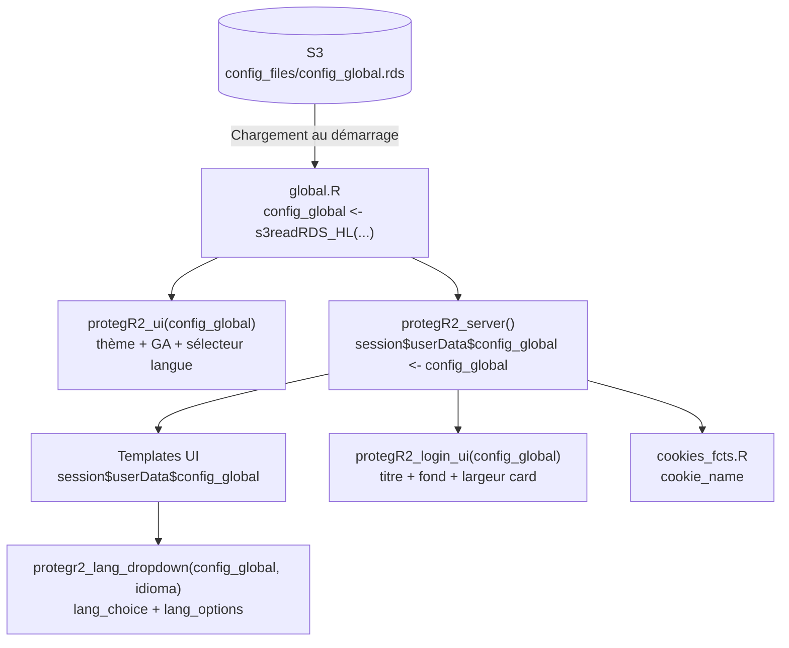

# Système de configuration — protegR2

## Vue d'ensemble

`config_global` est la liste de configuration centrale de l'application. Elle
est stockée sur S3 (`config_files/config_global.rds`), chargée une fois au
démarrage dans `global.R`, puis distribuée via `session$userData$config_global`
à tous les modules et templates.

La structure est organisée **par package** : chaque package utilisé dans le
projet possède sa propre sous-liste (`config_global$protegR2`, `config_global$OTP`,
etc.). Cela évite les collisions de noms et rend les dépendances explicites.

> ⚠️ **Migration en cours** — le code du package utilise encore les anciens noms
> de champs (structure plate). La migration vers la nouvelle structure est planifiée
> dans Phase 2.3d du fichier `inst/package_dev/plan.md`.

---

## Structure de `config_global$protegR2`

```r
config_global$protegR2 <- list(

  # ── Session & cookie ──────────────────────────────────────────────────────
  cookie_name = "mon_app_session",   # Nom du cookie navigateur

  # ── Langue ───────────────────────────────────────────────────────────────
  lang_choice  = TRUE,               # Afficher le sélecteur de langue ?
  lang_default = "fr",               # Langue par défaut au démarrage
  lang_options = list(               # Langues disponibles
    fr = list(mini_label = "FR", label = "Français"),
    en = list(mini_label = "EN", label = "English"),
    es = list(mini_label = "ES", label = "Español")
  ),

  # ── Interface ─────────────────────────────────────────────────────────────
  header_title = "Mon Application",  # Titre affiché dans la navbar / login
  theme = list(
    bootswatch = "darkly",           # Thème Bootswatch (voir bootswatch.com)
    primary    = "#3c8dbc"           # Couleur primaire Bootstrap
  ),
  ga_id = NULL,                      # Google Analytics ID (ex: "G-XXXXXXXXXX")
                                     # NULL = désactivé

  # ── Sécurité ──────────────────────────────────────────────────────────────
  security = list(
    token_check_interval_s = 45,     # Vérification token S3 (secondes)
    cookie_throttle_ms     = 240000, # Throttle refresh cookie (ms = 4 min)
    max_login_attempts     = 5,      # Tentatives avant verrou
    lockout_duration_s     = 30      # Durée du verrou brute force (secondes)
  ),

  # ── Page de login ─────────────────────────────────────────────────────────
  login = list(
    background_img = "/images/background.png", # Image de fond (inst/app/www/)
    welcome_text   = NULL,           # Texte sous le titre (NULL = absent)
    logo_url       = NULL,           # Logo au-dessus du formulaire (NULL = absent)
    card_width_px  = 420             # Largeur max de la card de login (px)
  )
)
```

---

## Flux de `config_global` dans l'application



**Règle clé** : `config_global` est chargé **une seule fois** au démarrage dans
`global.R` (partagé entre toutes les sessions Shiny). Il est ensuite copié dans
`session$userData$config_global` à chaque nouvelle session — ce qui le rend
accessible aux modules et templates sans couplage au namespace du package.

---

## Correspondance anciens / nouveaux noms

| Ancien nom (code actuel) | Nouveau nom (nouvelle structure) | Notes |
|---|---|---|
| `config_global$cookie_name` | `config_global$protegR2$cookie_name` | |
| `config_global$show_idioma` | `config_global$protegR2$lang_choice` | Renommé pour clarté |
| `config_global$idioma` | `config_global$protegR2$lang_default` | |
| `config_global$supported_idiomas` | `config_global$protegR2$lang_options` | Cohérent avec `lang_choice` |
| `config_global$bootswatch` | `config_global$protegR2$theme$bootswatch` | Regroupé dans `theme` |
| `config_global$primary_color` | `config_global$protegR2$theme$primary` | Regroupé dans `theme` |
| `config_global$ga_id` | `config_global$protegR2$ga_id` | |
| `config_global$header_title` | `config_global$protegR2$header_title` | |
| `config_global$cookie_update_time` | `config_global$protegR2$security$cookie_throttle_ms` | Unité changée : s → ms |
| *(absent)* | `config_global$protegR2$security$*` | Nouveau — centralise les magic numbers |
| *(absent)* | `config_global$protegR2$login$*` | Nouveau — personnalisation page login |

---

## Initialisation sur S3

### `protegR2_init_config_global(name, value)` — `R/protegR2_init.R`

Ajoute ou met à jour un champ dans `config_files/config_global.rds` sur S3.
Si le fichier n'existe pas encore, il est créé (liste vide).

```r
# Exemples d'initialisation (dans inst/dev/01_protegR2_start.R)
protegR2_init_config_global("cookie_name", "mon_app")
protegR2_init_config_global("idioma", "fr")
protegR2_init_config_global("header_title", "Mon Application")
```

> ⚠️ Cette fonction opère sur la **structure plate** actuelle. Avec la nouvelle
> structure, il faudra passer une sous-liste entière :
> `protegR2_init_config_global("protegR2", list(cookie_name = "...", ...))`

### Chargement dans `global.R`

```r
# 1. Connexion S3
config_s3_location <- readRDS("inst/app/data/config_s3_location.rds")
config_s3_access   <- readRDS("inst/app/data/config_s3_access.rds")
s3_connection_HL()

# 2. Chargement depuis S3
config_global <- s3readRDS_HL(object = "config_files/config_global.rds")

# 3. Surcharges locales (pour tests sans toucher S3)
config_global$show_idioma <- TRUE
config_global$supported_idiomas <- list(...)
```

Les surcharges locales dans `global.R` permettent de tester des valeurs sans
modifier le fichier S3. Elles ne survivent pas à un redémarrage de l'app sur
le serveur (le fichier S3 reste source de vérité).

---

## Champs utilisés par composant

| Composant | Champs lus |
|---|---|
| `protegR2_ui()` | `theme$bootswatch`, `theme$primary`, `ga_id`, `lang_choice`, `lang_default` |
| `protegR2_server()` | `lang_default` (init `idioma` reactiveVal) |
| `cookies_fcts.R` | `cookie_name` |
| `protegr2_lang_dropdown()` | `lang_choice`, `lang_options`, `lang_default` |
| `protegr2_layout_controls()` | — (pas de config_global direct) |
| Templates | `header_title`, via `protegr2_lang_dropdown()` |
| `protegR2_login_ui()` | `header_title`, `login$*` (après migration) |

---

## Configuration multi-projets

Chaque projet a son propre `config_global.rds` sur S3. La structure par package
permet à plusieurs packages de coexister sans interférence :

```r
config_global <- list(
  protegR2 = list(
    cookie_name  = "finance_session",
    header_title = "Finance App",
    ...
  ),
  OTP = list(
    api_key = "...",
    ...
  ),
  logpage = list(
    log_level = "INFO",
    ...
  )
)
```

Le fichier `inst/dev/01_protegR2_start.R` (copié dans le projet via
`protegR2_init()`) contient le code d'initialisation complet avec des valeurs
de démonstration. Ce fichier est en `.gitignore` — il peut contenir des clés
d'API et credentials sans risque d'exposition.

---

## Référence du code

| Composant | Fichier | Symboles clés |
|---|---|---|
| Initialisation S3 | `R/protegR2_init.R` | `protegR2_init_config_global()` |
| Chargement démarrage | `inst/files_to_copy/R/global.R` | `s3readRDS_HL("config_files/config_global.rds")` |
| Capture session | `R/protegR2.R` | `session$userData$config_global <- config_global` |
| Usage UI | `R/protegR2.R` | `protegR2_ui(config_global, ...)` |
| Usage langue | `R/protegR2_utils_ui.R` | `protegr2_lang_dropdown(config_global, idioma)` |
| Setup projet | `inst/files_to_copy/dev/01_protegR2_start.R` | Valeurs de démonstration |

---

## Glossaire

| Terme | Définition |
|---|---|
| `config_global` | Liste R chargée depuis S3 au démarrage, distribuée à toutes les sessions |
| `session$userData$config_global` | Copie par session de `config_global` — accès depuis modules sans couplage au package |
| `lang_options` | Liste nommée des langues disponibles : clé = code ISO, valeur = `list(mini_label, label)` |
| `lang_choice` | Boolean — afficher ou masquer le sélecteur de langue dans l'UI |
| Surcharge locale | Valeur définie dans `global.R` après le chargement S3 — écrase temporairement la valeur S3 |
