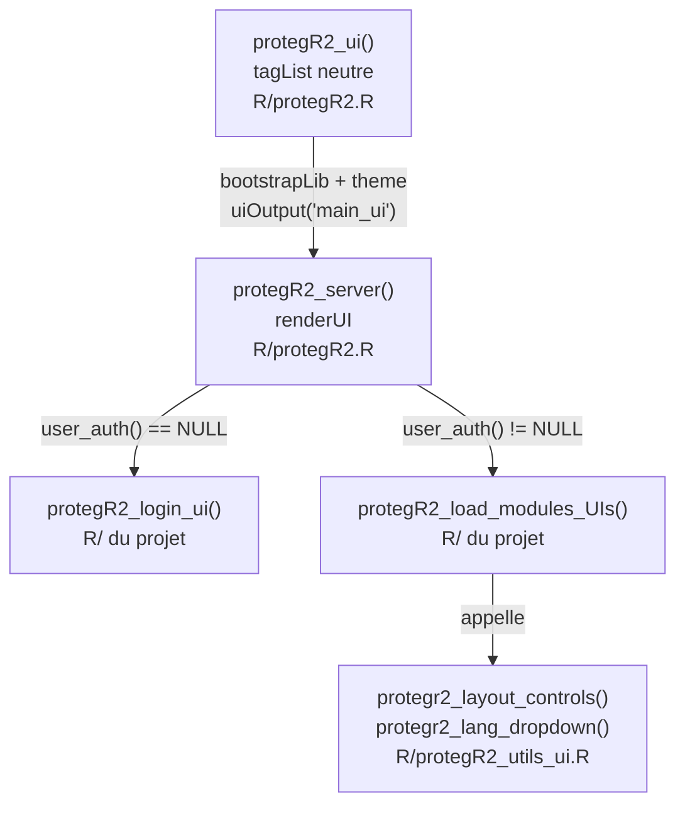

# Architecture multi-layout — protegR2

## Vue d'ensemble

protegR2 supporte 5 styles de layout bslib (`sidebar`, `navbar`, `fluid`,
`fixed`, `fillable`). L'architecture repose sur un **wrapper neutre** côté
package (`protegR2_ui()` + `protegR2_server()`) et des **templates copiés dans
le projet** (`protegR2_load_modules_UIs.R`). Chaque template possède son propre
`page_*()` bslib — le package n'impose aucune structure de page.

---

## Diagramme d'architecture



---

## `protegR2_ui()` — le wrapper neutre

**Fichier :** `R/protegR2.R`

Retourne un `tagList()` et **non** un `page_*()`. Ce choix est délibéré : un
`page_fluid()` wrapper ajouterait un `div.container-fluid` dans le DOM, créant
un `page_*()` imbriqué dans un autre quand le template retourne son propre
`page_sidebar()` ou `page_fillable()` — layout cassé pour les styles plein écran.

`tagList()` est un conteneur neutre. `bootstrapLib(theme)` injecte directement
le thème Bootstrap dans `<head>` sans imposer de structure.

**Éléments rendus par `protegR2_ui()` :**

| Élément | Classe CSS | Position | Rôle |
|---|---|---|---|
| Theme bslib | — | `<head>` | Bootswatch + couleur primaire |
| Script GA4 | — | `<head>` | Optionnel, si `ga_id` configuré |
| Handler JS `forceDisconnect` | — | `<head>` | Popup + reload sur déconnexion forcée |
| Sélecteur de langue | `.protegr2-idioma-fixed` | `fixed top:10px right:15px` | Visible sur login ET app (masqué par templates) |
| Placeholder | `uiOutput("main_ui")` | Corps | Remplacé par login ou app |

---

## `protegR2_server()` — le renderUI central

**Fichier :** `R/protegR2.R`

`output$main_ui` est ré-exécuté à chaque changement de `user_auth()` :

```
user_auth() == NULL  →  .login_ui(config_global, tr)
user_auth() != NULL  →  tagList(
                           bouton logout fixe (.protegr2-logout-fixed),
                           .load_modules_UIs(session, tr)
                         )
```

**Bouton logout fixe** : `position: fixed; top: 10px; right: 140px; z-index: 9998`.
Les templates qui intègrent leur propre logout le masquent via
`protegr2_layout_controls()`.

**Capture des fonctions projet via `project_fn()`** :
Les templates vivent dans `R/` du projet — inaccessibles directement depuis le
namespace du package installé. `project_fn()` remonte `sys.frames()` pour les
trouver. Cette capture se fait **au démarrage** (contexte non-réactif), puis les
références sont réutilisées dans les contextes réactifs.

```r
.login_ui         <- project_fn("protegR2_login_ui")
.load_modules_UIs <- project_fn("protegR2_load_modules_UIs")
```

**Restauration de l'onglet actif** : les templates lisent
`isolate(getQueryString(session))$page` directement pendant le rendu pour
définir l'onglet sélectionné. `observeEvent(input$nav_tab, ...)` écrit `?page=`
dans l'URL à chaque navigation (uniquement pour les templates avec `id="nav_tab"`).

---

## Fonctions utilitaires partagées

### `protegr2_layout_controls(gear)` — `R/protegR2_utils_ui.R`

Retourne un `tagList()` présent au début de chaque template :

1. **CSS masquant les boutons fixes** (`display: none !important`) :
   - `.protegr2-logout-fixed` — le bouton logout fixe de `protegR2_server()`
   - `.protegr2-idioma-fixed` — le sélecteur de langue fixe de `protegR2_ui()`

2. **Bouton engrenage flottant** (si `gear = TRUE`) :
   - `position: fixed; bottom: 24px; right: 24px; z-index: 9997`
   - `inputId = "open_config_modal"` — écouté dans `protegR2_load_modules_servers.R`

### `protegr2_lang_dropdown(config_global, idioma)` — `R/protegR2_utils_ui.R`

Construit le dropdown Bootstrap de sélection de langue depuis
`config_global$protegR2$lang_options`. Retourne `NULL` si `lang_choice` est
`FALSE` — ignoré silencieusement par `tagList()`. Dans `navbar.R`, le résultat
est enveloppé dans `nav_item()` pour s'intégrer au hamburger mobile.

---

## Comparaison des 6 templates

| Template | `page_*()` | `gear` | Config | Logout + Langue | `id="nav_tab"` | Dépendance |
|---|---|---|---|---|---|---|
| `sidebar.R` | `page_sidebar()` | TRUE | Modal (⚙ flottant) | Header flexbox | Non | bslib |
| `fluid.R` | `page_fluid()` | TRUE | Modal (⚙ flottant) | Header flexbox | Non | bslib |
| `fixed.R` | `page_fixed()` | TRUE | Modal (⚙ flottant) | Header flexbox | Non | bslib |
| `fillable.R` | `page_fillable()` | TRUE | Modal (⚙ flottant) | Header flexbox | Non | bslib |
| `navbar.R` | `page_navbar()` | FALSE | `nav_menu()` intégré | `nav_item()` dans navbar | **Oui** | bslib |
| `sidebarHL.R` | `page_sidebarHL()` | FALSE | `hl_nav_group()` intégré | `header_items` | **Oui** | **bslibHL** |

**`navbar.R` et `sidebarHL.R`** utilisent `id="nav_tab"` et supportent la
restauration d'onglet via URL. Les autres templates n'ont pas de composant de
navigation au niveau du layout.

**`navbar.R` et `sidebarHL.R`** utilisent `gear = FALSE` — leur configuration
est intégrée directement dans la navigation. Tous les autres templates utilisent
`gear = TRUE` et ont besoin du bloc `observeEvent(input_main_app$open_config_modal, ...)`
dans `protegR2_load_modules_servers.R`.

**`sidebarHL.R` se distingue** des autres templates par `protegR2_compat = TRUE`
sur `page_sidebarHL()` — ce paramètre remplace entièrement l'appel à
`protegr2_layout_controls()` : c'est `bslibHL` lui-même qui injecte le CSS
masquant les boutons fixes. Ne pas appeler `protegr2_layout_controls()` dans ce
template.

---

## Patron CSS : shadowing des boutons fixes

Les boutons logout et langue sont **toujours rendus** en position fixe par
`protegR2_ui()` et `protegR2_server()`. Les templates qui les intègrent dans
leur propre structure les masquent via CSS plutôt que via une condition serveur —
plus simple, aucun état à synchroniser.

```
protegR2_ui()         → .protegr2-idioma-fixed   (visible sur login)
protegR2_server()     → .protegr2-logout-fixed   (visible quand connecté)
                              ↓
Template (gear = TRUE) → hide_fixed CSS           → boutons fixes masqués
                       → propre header + dropdown → boutons intégrés visibles
```

**IDs dupliqués** (`input$logout`, `input$select_idioma`) : les deux instances
(fixe + template) partagent le même `inputId`. Shiny enregistre les deux mais
seul le visible interagit. Un seul `observeEvent` côté serveur suffit.

---

## Fichiers copiés dans le projet

Ces fichiers ne font pas partie du package compilé — ils sont copiés dans `R/`
du projet via `protegR2_init_project()` et `protegR2_init_layout()` :

| Fichier | Rôle | Modifiable |
|---|---|---|
| `protegR2_login_ui.R` | UI de la page de login | ✅ Conçu pour être personnalisé |
| `protegR2_load_modules_UIs.R` | Layout et modules UI selon le rôle | ✅ À adapter par projet |
| `protegR2_load_modules_servers.R` | Démarrage des modules serveur | ✅ À adapter par projet |

Les templates sources sont dans `inst/files_to_copy/template_UIs_style/`.
`protegR2_init_layout("navbar")` copie le bon template sous le nom
`protegR2_load_modules_UIs.R`.

---

## Référence du code

| Composant | Fichier | Symboles clés |
|---|---|---|
| Wrapper UI | `R/protegR2.R` | `protegR2_ui()` |
| Orchestration serveur | `R/protegR2.R` | `protegR2_server()`, `output$main_ui` |
| Utilitaires UI | `R/protegR2_utils_ui.R` | `protegr2_layout_controls()`, `protegr2_lang_dropdown()` |
| Templates | `inst/files_to_copy/template_UIs_style/` | `sidebar.R`, `navbar.R`, `fluid.R`, `fixed.R`, `fillable.R`, `sidebarHL.R` |
| Initialisation | `R/protegR2_init.R` | `protegR2_init_layout()` |
| Capture projet | `R/project_fn.R` | `project_fn()` |
