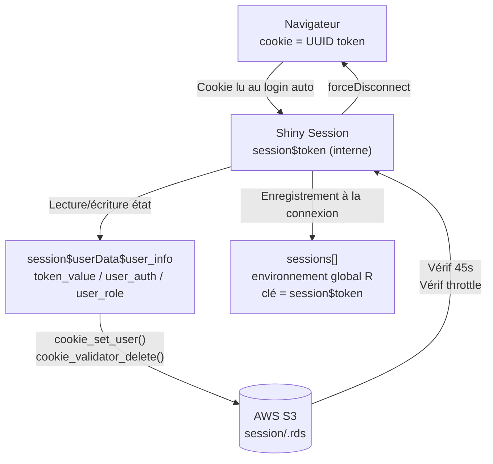
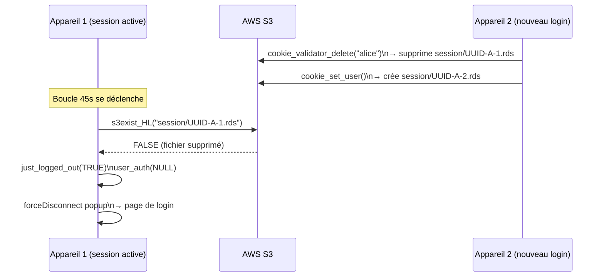

# Gestion des sessions — protegR2

## Vue d'ensemble

La gestion des sessions dans protegR2 repose sur trois couches complémentaires :
un token UUID stocké sur S3 (source de vérité), un cookie navigateur qui contient
uniquement ce token, et un environnement R global (`sessions[]`) qui trace les
connexions Shiny actives en mémoire. Cette architecture permet la détection
passive de sessions simultanées et la déconnexion automatique après inactivité,
sans base de données relationnelle.

---

## Diagramme d'architecture



---

## Les deux tokens — à ne pas confondre

| | `session$token` | `token_value` |
|---|---|---|
| Assigné par | Shiny automatiquement | Notre code au login (`UUIDgenerate()`) |
| Type | Chaîne interne Shiny | UUID v4 (122 bits aléatoires) |
| Stocké dans | `sessions[]` comme clé | S3 + cookie navigateur |
| Portée | Durée de la connexion WebSocket | `inactivity_delay` minutes |
| Rôle | Identifier la connexion dans cette instance Shiny | Identifier la session entre appareils et redémarrages |

**Relation concrète :**
```r
sessions[[session$token]] = list(
  session       = <objet session Shiny>,   # pour envoyer des messages
  valid_user_df = <1 ligne users_auth.rds> # données de l'utilisateur
)
# session$token  → identifie la connexion WebSocket
# token_value    → identifie la session multi-appareils (dans cookie + S3)
```

---

## Stockage : ce qui va où

### S3 — `session/<token_value>.rds`

Créé par `cookie_set_user()`, supprimé par `perform_logout()` et
`cookie_validator_delete()`.

| Champ | Contenu |
|---|---|
| `token_value` | UUID v4 |
| `expiration` | `Sys.time() + (inactivity_delay * 60)` |
| `finger_print` | `digest(IP)_digest(User-Agent)` |
| `username` | Identifiant de l'utilisateur |

### Cookie navigateur

| Attribut | Valeur |
|---|---|
| Nom | `config_global$protegR2$cookie_name` |
| Valeur | `token_value` (UUID uniquement — rien de sensible) |
| Expiration | `inactivity_delay / (60 * 24)` jours |

### `session$userData$user_info` (mémoire, par session)

| Champ | Type | Contenu | Réactif |
|---|---|---|---|
| `valid_user` | `reactiveVal(list)` | Ligne complète de users_auth.rds | ✓ |
| `token_value` | `character` | UUID v4 | ✗ |
| `user_auth` | `reactiveVal(char)` | NULL = déconnecté \| username = connecté | ✓ |
| `user_role` | `reactiveVal(char)` | "user" \| "admin" \| "super_admin" \| "dev" | ✓ |

### `sessions[]` (mémoire, global)

Environnement R défini dans `global.R` du projet. Clé = `session$token` Shiny.

```r
sessions[[session$token]] <- list(
  session       = <Shiny session>,
  valid_user_df = <dataframe 1 ligne>
)
```

---

## Processus de fond

### Boucle de vérification S3 — toutes les 45 secondes

`invalidateLater(45000)` dans un `observe()` crée un cycle qui s'exécute tant
que l'utilisateur est connecté (`req(user_auth())` stoppe le cycle au logout).

```
Toutes les 45 secondes
  │
  └─ s3exist_HL("session/<token_value>.rds") ?
       ├─ OUI → session valide, rien à faire
       └─ NON → token supprimé par un autre login (Option B)
                ├─ just_logged_out(TRUE)   ← bloque l'auto-login
                ├─ sendCustomMessage("forceDisconnect", ...)
                │    → popup navigateur + location.reload()
                └─ user_auth(NULL)         ← retour à la page de login
```

**Pourquoi S3 et non `get_cookie()` ?**
`input$cookies` est une snapshot au chargement initial — il ne se met jamais à
jour pendant la session. Après un `set_cookie()`, il reste figé sur l'ancienne
valeur. S3 est la seule source de vérité cohérente.

### Rafraîchissement du cookie — toutes les 4 minutes d'activité

`throttle(reactive(reactiveValuesToList(input)), 240000)` écoute toutes les
interactions, limitées à une exécution max toutes les 4 minutes.

```
Interaction utilisateur (clic, frappe, etc.)
  │
  └─ Seulement si connecté
       ├─ Token S3 existe et non expiré ?
       │    └─ OUI → cookie_set_user() : renouvelle expiration S3 + cookie
       └─ NON → session invalide détectée
                just_logged_out(TRUE) + user_auth(NULL)
```

---

## Détection de session simultanée (Option B)

Quand un utilisateur se connecte sur un 2e appareil, l'ancienne session est
invalidée **passivement** — elle le découvre lors de la prochaine vérification
(dans les 45 secondes).



**Fenêtre de coexistence** : les deux sessions coexistent pendant au plus 45
secondes — acceptable car le token S3 est déjà invalide dès le 2e login.

---

## Logout complet vs. fermeture d'onglet

| Action | `perform_logout()` | `onSessionEnded()` |
|---|---|---|
| Contexte | Clic bouton — contexte réactif actif | Fermeture WebSocket — contexte réactif détruit |
| Suppression S3 | ✅ Token courant + tokens expirés | ❌ Expiration naturelle |
| `sessions[]` | ✅ Nettoyage ciblé | ✅ `rm(list = session$token)` |
| Cookie navigateur | ✅ `cookie_remove_user()` | ❌ Impossible |
| forceDisconnect | ✅ Envoyé aux sessions concurrentes | ❌ Impossible |
| `user_auth(NULL)` | ✅ | ❌ reactiveVal inaccessible |

`onSessionEnded()` fait le strict minimum (supprimer l'entrée de `sessions[]`)
car Shiny a déjà détruit le contexte réactif. Tout le reste est délégué à
l'expiration naturelle ou au prochain login de l'utilisateur.

---

## Le flag `just_logged_out`

Sans ce flag, un logout déclencherait immédiatement un auto-login :

```
Logout → user_auth(NULL) → observe auto-login se déclenche
       → cookie encore dans le navigateur (suppression async)
       → reconnexion immédiate !
```

`just_logged_out(TRUE)` bloque l'observe d'auto-login pendant le nettoyage.
Il repasse à `FALSE` au prochain clic sur le bouton login (login manuel).

---

## Référence du code

| Composant | Fichier | Fonctions clés |
|---|---|---|
| Boucle 45s + throttle | `R/protegR2.R` | `protegR2_server()` — blocs `observe()` et `observeEvent(throttled_inputs())` |
| Login / Logout | `R/perform_login_logout.R` | `perform_login()`, `perform_logout()` |
| Cookie & session S3 | `R/cookies_fcts.R` | `cookie_set_user()`, `cookie_remove_user()`, `cookie_auto_login()`, `cookie_validator_delete()` |
| Environnement sessions | `global.R` du projet | `sessions <- new.env()` |
